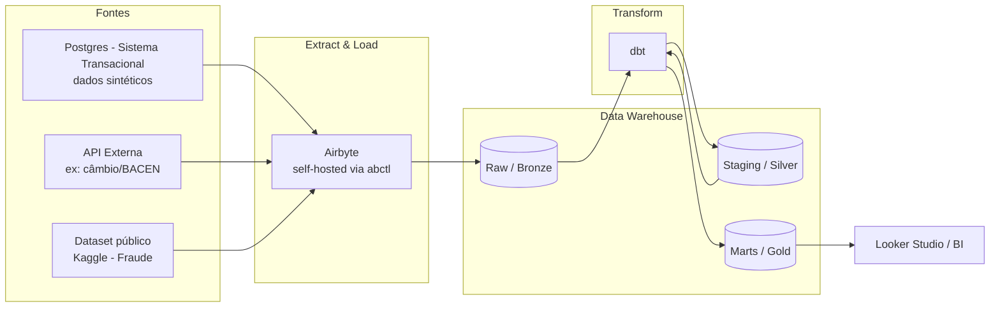

# Fintech Data Pipeline

> Pipeline de dados end-to-end para um cenário de fintech, cobrindo ingestão (EL), transformação (T) e modelagem analítica — construído como projeto de estudo aplicado em Engenharia de Dados.


---

## Sobre o projeto

Este projeto simula o pipeline de dados de uma fintech que precisa consolidar dados de **transações financeiras** vindas de múltiplas fontes (sistema transacional interno + fontes externas) em um Data Warehouse confiável para análise de negócio (ex: detecção de padrões de fraude, relatórios financeiros, taxas de câmbio aplicadas).

O objetivo não é só "fazer funcionar", mas **documentar o raciocínio de engenharia por trás de cada decisão** — arquitetura, trade-offs de custo, qualidade de dados e escalabilidade — como um projeto real de produção exigiria.

**Este é um projeto de aprendizado ativo.** As seções abaixo são atualizadas conforme cada etapa é implementada — não é uma reconstrução retroativa de um projeto "pronto".

---

## Arquitetura

> 🚧 Diagrama completo será adicionado ao final do Bloco de Modelagem de Dados. Visão preliminar abaixo:



**Padrão adotado:** ELT (Extract-Load-Transform) com arquitetura em camadas (medalhão: Bronze → Silver → Gold).

---

## Stack Tecnológico

| Camada                      | Ferramenta                          | Status             |
| --------------------------- | ----------------------------------- | ------------------ |
| Orquestração de ingestão | Airbyte (self-hosted, via`abctl`) | ✅ Instalado       |
| Fonte transacional          | PostgreSQL (dados sintéticos)      | 🚧 Em construção |
| Fonte externa               | API pública (câmbio/BACEN)        | 📋 Planejado       |
| Dataset complementar        | Kaggle (Credit Card Fraud)          | 📋 Planejado       |
| Data Warehouse              | Snowflake                           | 📋 Planejado       |
| Transformação             | dbt                                 | 📋 Planejado       |
| BI / Visualização         | Looker Studio                       | 📋 Planejado       |
| Testes de qualidade         | dbt tests + dbt-expectations        | 📋 Planejado       |

---

## Estrutura do Repositório

```
fintech-data-pipeline/
├── README.md
├── docs/
│   ├── architecture.md        # Diagramas detalhados (a partir do Bloco de Modelagem)
│   └── decisions/              # ADRs (Architecture Decision Records)
├── airbyte/
│   └── connections/            # Configurações exportadas (sem credenciais)
├── dbt_project/
│   ├── models/
│   │   ├── staging/
│   │   ├── intermediate/
│   │   └── marts/
│   └── tests/
├── data_generator/              # Scripts Python para gerar dados sintéticos
├── .env.example                 # Template de variáveis de ambiente (sem valores reais)
└── .gitignore
```

---

## Como rodar localmente

> 🚧 Instruções completas de setup serão finalizadas ao fim do projeto. Progresso atual:

### Pré-requisitos

- Docker Engine
- `abctl` (CLI do Airbyte)
- Python 3.x (para o gerador de dados sintéticos)

### 1. Airbyte

```bash
abctl local install
abctl local credentials
```

Acesse `http://localhost:8000` com as credenciais geradas.

> Para liberar recursos da máquina sem perder configurações:
>
> ```bash
> abctl local uninstall --persisted
> ```

### 2. Demais etapas

📋 Serão documentadas conforme implementadas (fonte sintética, dbt, warehouse).

---

## Fontes de Dados

| Fonte                                        | Tipo                                  | Justificativa                                                            |
| -------------------------------------------- | ------------------------------------- | ------------------------------------------------------------------------ |
| PostgreSQL sintético (transações, contas) | Sintética (gerada via script Python) | Controle total para simular CDC, updates e schema drift intencionalmente |
| API de câmbio (ex: Banco Central do Brasil) | Real                                  | Contexto de negócio real para conversão de moeda                       |
| Kaggle - Credit Card Fraud Detection         | Real                                  | Volume e realismo para modelos analíticos finais                        |

---

## Data Quality & Testes

> 📋Seção será preenchida a partir do bloco de testes automatizados no dbt.

Princípios adotados (definidos desde o início do projeto):

- Testes de **schema** (estrutura) são responsabilidade da camada de ingestão (Airbyte).
- Testes de **regra de negócio** (ex: valores financeiros não podem ser negativos, exceto estornos) são responsabilidade do dbt.
- Uso de `severity: error` vs `warn` calibrado por criticidade — evitando tanto falhas silenciosas quanto bloqueios desproporcionais ao risco real.

---

## Decisões Técnicas (ADRs)

Registro das principais decisões de arquitetura tomadas até agora, e o porquê:

### ADR-001: ELT em vez de ETL

**Decisão:** Adotar arquitetura ELT (transformação dentro do warehouse via dbt), em vez de ETL clássico.
**Motivo:** Preserva o dado bruto (bronze) de forma imutável, permitindo reprocessamento caso regras de negócio mudem, sem depender de reextração da fonte, especialmente relevante quando a fonte é transacional (dados podem ser sobrescritos/deletados na origem).
**Trade-off aceito:** Maior consumo de storage (dado bruto retido) e necessidade de monitorar custo de compute no warehouse.

### ADR-002: Airbyte self-hosted (via `abctl`) em vez de Airbyte Cloud

**Decisão:** Rodar Airbyte localmente (self-hosted), usando `abctl` (Kubernetes-in-Docker via `kind`).
**Motivo:** Ambiente de estudo sem custo de SaaS; replica o mesmo modelo operacional usado por empresas com exigências de residência de dados (compliance).
**Trade-off aceito:** Overhead de manter a própria infraestrutura (cluster local), sem suporte gerenciado.

### ADR-003: Carga direta no Snowflake em vez de Data Lake intermediário (S3)

**Decisão:** Airbyte carrega os dados diretamente em um schema `raw` no Snowflake, sem uma camada de Data Lake (S3/GCS) intermediária persistente.
**Motivo:** Para o volume de dados deste projeto (dados sintéticos + um dataset público), a complexidade operacional extra de manter e sincronizar uma camada S3 intermediária não se justifica. A imutabilidade da camada bronze é garantida dentro do próprio Snowflake (tabela `raw` nunca é sobrescrita).
**Trade-off aceito:** Menor flexibilidade para múltiplos consumidores dos dados brutos (ex: um cluster Spark externo não conseguiria ler os dados brutos sem passar pelo Snowflake) e possível custo maior de storage a longo prazo comparado a S3.
**Quando revisitar:** Se o volume de dados brutos crescer significativamente (ordem de terabytes raramente reconsultados) ou se surgir um segundo consumidor dos dados brutos além do próprio warehouse (ex: um pipeline de ML separado), vale reavaliar a introdução de uma camada S3 como landing zone.

### ADR-004: Incremental | Append + Deduped como sync mode principal (CDC como experimento paralelo)

**Decisão:** A tabela `transacoes` será sincronizada via Incremental | Append + Deduped (Primary Key: `transacao_id`, Cursor Field: `updated_at`), não via CDC log-based.
**Motivo:** No domínio de negócio (fintech), transações não sofrem hard delete por questões de auditoria/compliance, usam soft delete (campo de status). Isso elimina a principal vantagem do CDC (captura de deleções físicas) para este caso de uso, enquanto o CDC exige setup mais complexo (replication slot, `wal_level = logical`, permissões elevadas no Postgres).
**Trade-off aceito:** Se um `UPDATE` na fonte não atualizar corretamente o campo `updated_at` (ex: script administrativo que ignora triggers), a mudança não será capturada, risco que o CDC log-based não teria.
**Nota de aprendizado:** CDC será implementado como uma conexão paralela/experimental no projeto, especificamente para fins de estudo comparativo (documentado como aprendizado, não como necessidade do caso de uso principal).

### ADR-005: Postgres local como Destination temporária (Snowflake ativado apenas a partir do bloco de dbt)

**Decisão:** Usar um PostgreSQL local como Destination do Airbyte durante os blocos de Ingestão e Modelagem. O trial do Snowflake ($400 em créditos, válido por 30 dias corridos a partir da ativação) só será ativado ao iniciar o bloco de dbt.
**Motivo:** O trial do Snowflake expira em 30 dias corridos independentemente do uso, ativá-lo prematuramente desperdiçaria tempo de trial em etapas que não dependem dele (configuração de Source/Sync Modes no Airbyte). Além disso, um Postgres local permite estudar configuração de banco de dados e planos de execução (relevante para otimização de queries) de forma mais transparente que um warehouse gerenciado.
**Trade-off aceito:** Será necessário migrar a configuração de Destination do Airbyte de Postgres para Snowflake quando o trial for ativado, trabalho de reconfiguração que será documentado como parte do aprendizado.


---

## Roadmap

- [X] Setup do ambiente Airbyte (self-hosted)
- [ ] Modelagem da fonte transacional sintética
- [ ] Configuração de conexões (Full Refresh, Incremental, CDC)
- [ ] Modelagem de dados (bronze/silver/gold)
- [ ] Implementação dos modelos dbt
- [ ] Testes de qualidade de dados
- [ ] Deploy em produção (Snowflake)
- [ ] Dashboard final (Looker Studio)

---

## Aprendizados

> 📋 Seção para registrar decisões revisadas, erros encontrados e o que faria diferente — atualizada ao longo do projeto.

---

## Autor

Projeto desenvolvido como parte de estudo prático em Engenharia de Dados (Airbyte, dbt, SQL, Snowflake).
